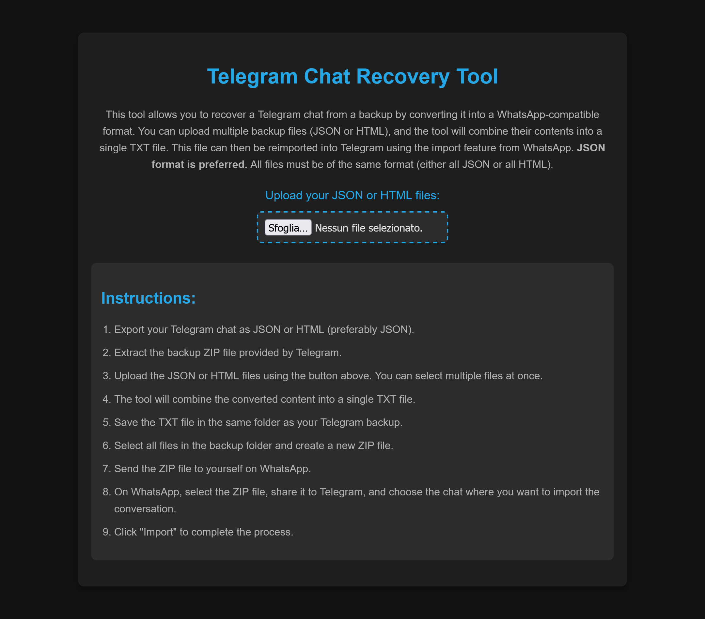

# Telegram Chat Recovery Tool

Telegram Chat Recovery Tool is a simple, user-friendly solution for recover Telegram chat backups into Telegram using the import feature from WhatsApp.

## Features

- Supports **JSON** (preferred) and **HTML** backup files.
- Allows uploading multiple files at once.
- Automatically combines backups into a single TXT file.
- Provides a step-by-step guide for seamless chat import to Telegram.

## Requirements

- A browser that supports JavaScript and HTML5 features.
- Telegram chat backup files in JSON or HTML format.

## How to Use

1. Export your Telegram chat as **JSON** (preferred) or **HTML**.
2. Extract the backup ZIP file provided by Telegram.
3. Open the `index.html` file in a browser.
4. Use the file upload feature to select your backup files (you can upload multiple files).
5. The tool will process the files and create a single **TXT** file.
6. Save the generated TXT file in the same folder as your Telegram backup.
7. Repackage the folder into a ZIP file.
8. Send the ZIP file to yourself on WhatsApp.
9. On WhatsApp, share the ZIP file to Telegram and choose the chat where you want to import the conversation.
10. Click "Import" to complete the process.

## File Structure

- **index.html**: The main interface of the tool.
- **styles.css**: Contains the styling for the application.
- **converter.js**: Handles the file processing logic.

## Installation

No installation is required. Simply download or clone the repository, then open the `index.html` file in your browser to start using the tool.

## Screenshots

## Contributions

Contributions are welcome! Feel free to open issues or submit pull requests to improve the tool.
